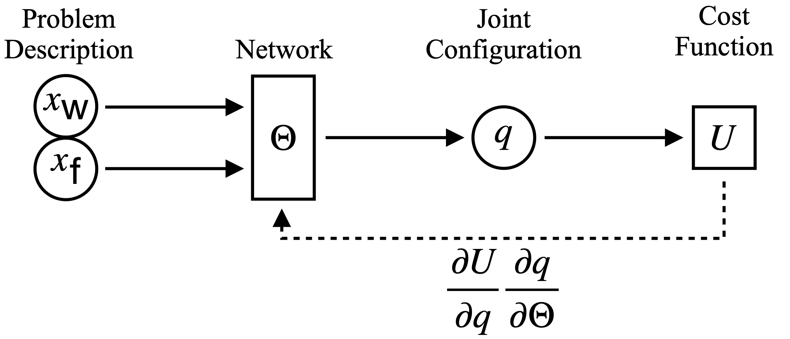
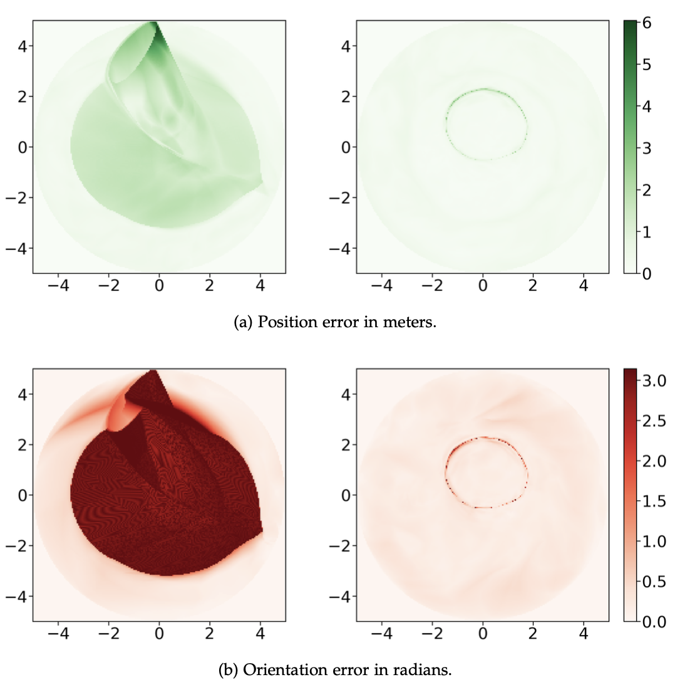
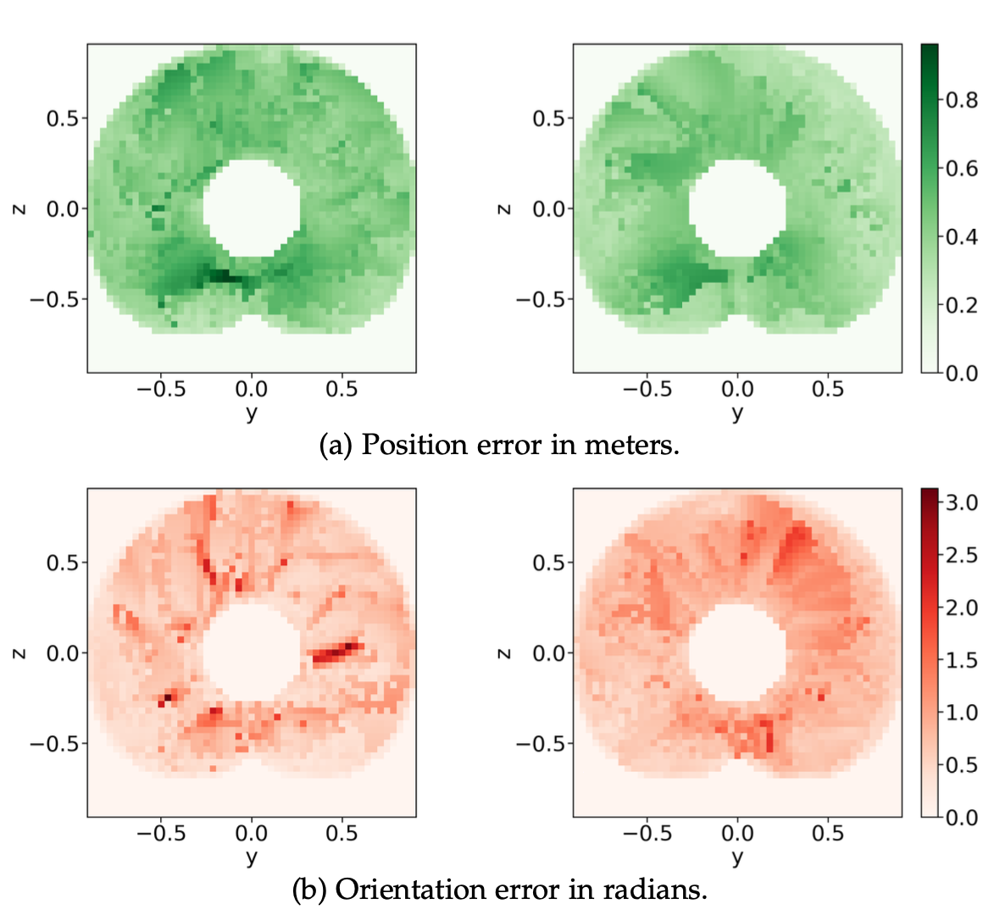

## Unsupervised Regression
{:.this
    style="width: 600px;
    display: block;
    margin-left: auto;
    margin-right: auto"}
*Information flow through the neural network.
The IK problem is described by a world \\( x_{\text{w}} \\), and a frame in the workspace \\(x_{\text{f}}\\) and the network should predict a collision-free joint configuration \\(q\\) that satisfies the end-effector.
The dotted line indicates the backpropagation during unsupervised training, where the network weights \\(\Theta\\) are directly updated according to the gradient of the cost function \\(U\\).*

---
## Joint Representation 
{:.this
    style="width: 600px;
    display: block;
    margin-left: auto;
    margin-right: auto"}
*Comparison between a model that represents joint angles using radians (left) and one that represents them as points on the unit circle (right). 
At each position, the plots show the maximum error for Flat Arm over 2880 evenly spaced target orientations.*
---

## Twin Heads
{:.this
style="width: 600px;
display: block;
margin-left: auto;
margin-right: auto"}
*The network prediction for a twin-headed network is shown along a line through the workspace.
The two heads are drawn in red and blue, respectively.  
The graph on the bottom shows the objective function U for the two heads.
In addition, green indicates the minimum of the two heads.
Along the trajectory, the minimum changes between head A and head B.
Those changes between the two modes are abrupt and discontinuous.
However, with two heads, one can change immediately to the optimal mode.
*

{:.this
style="width: 600px;
display: block;
margin-left: auto;
margin-right: auto"}
*The color map shows which head scores better for the objective function over the whole workspace: head "A" is red, and head "B" is blue.
The two heads perform differently over the workspace, and rotating the goal orientation changes this pattern.
Especially the symmetries in the kinematics become apparent when following a complete revolution.
In addition, the prediction of the network is shown at two positions.
For each, the better head is drawn in its respective color.*

{:.this
    style="width: 800px;
    display: block;
    margin-left: auto;
    margin-right: auto"}
*Comparison between a single-headed network (left) and a twin-headed network (right) for the IK prediction.
There are points in the workspace where the network needs to switch modes, to reach all possible targets.
The underlying red heat map indicates the worst orientation error across all \\(2\pi\\) possible (discretized with 2880) orientations at each position.
This switch happens not instantaneously but over a small range, which the dark red circle highlights.
Each head of the twin model also has switching points, but as those two regions do not intersect, it can always predict valid and smoothly changing configurations.
See also the accompanying video for a clearer visualization of the mode switch.*

[TODO add image]
*The two heads allow not only immediate switching between different modes, the prediction is also better in terms of 
objective function, than a single-headed network.*

## Boosting
{:.this
    style="width: 600px;
    display: block;
    margin-left: auto;
    margin-right: auto"}
*Comparison between a model without boosting (left) and one with boosting (right) on LWR III without obstacles. 
These plots show the maximum error over all target orientations at each position. 
The plots show a slice of the workspace at x = 0.*

