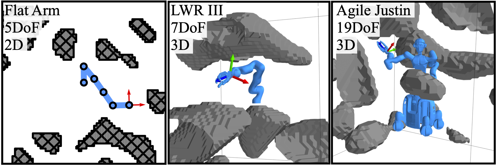

{:.this
style="width: 750px;
display: block;
margin-left: auto;
margin-right: auto"}
*The three robots used in the experiments in environments generated with Simplex Noise.
The Flat Arm in 2D is used to analyze and visualize the IK problem in detail.
The LWR III and Agile Justin demonstrate the capabilities of our method for complex robotic systems.*
